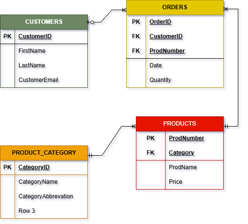

# 📊 Sales Performance Analytics Dashboard
**Virtual Internship Program — Bank Muamalat x Rakamin Academy**

This project analyzes sales performance using data from multiple relational tables and visualizes key insights through Google BigQuery and Looker Studio.

---

## 🧠 Objectives
- Perform data cleaning and integration using SQL in Google BigQuery
- Create a master table for analysis
- Visualize sales insights using Looker Studio Dashboard
- Provide actionable recommendations to improve sales and marketing strategy

---

## 🗂 Dataset Description

There are 4 main tables used in this project:

| Table Name         | Primary Key       | Description                                      |
| -----------------  | ---------------- | ------------------------------------------------ |
| **Customers**      | `CustomerID`     | Customer information: ID, Email, City, etc.     |
| **Products**       | `ProdNumber`     | Product information: Number, Name, Price, Category |
| **Orders**         | `OrderID`        | Order transactions: OrderID, Date, CustomerID, ProdNumber, Quantity |
| **ProductCategory**| `CategoryID`     | Product category info: ID, Name, Abbreviation   |

---

## 🧩 ERD (Entity Relationship Diagram)


---
## 📈 Dashboard Overview
  

- Tools used:

  - Google BigQuery
  - Looker Studio
  - Python (Pandas)
  - Draw.io
  - Google Sheets

---

## 💡 Insights
- Total sales reached $1,754,750.57 with 11,654 items sold
- Top-selling products: Robots and Drones
- Cities with highest revenue: Washington and Houston
- Most sold categories: eBooks and Training Videos

---

## 🧭 Recommendations
- Optimize inventory & marketing for top-performing products
- Focus campaigns on cities with high sales potential
- Implement BI monitoring to track product performance by region
- Consider promotions for underperforming categories to balance revenue


## ⚙️ Data Processing in BigQuery

Example query to create a **master sales table**:

```sql
SELECT 
  o.Date AS order_date,
  pc.CategoryName AS category_name,
  p.ProdName AS product_name,
  p.Price AS product_price,
  o.Quantity AS order_qty,
  (p.Price * o.Quantity) AS total_sales,
  c.CustomerEmail AS cust_email,
  c.CustomerCity AS cust_city
FROM `finalproject-476410.master_sales.orders` AS o
JOIN `finalproject-476410.master_sales.customers` AS c
  ON o.CustomerID = c.CustomerID
JOIN `finalproject-476410.master_sales.products` AS p
  ON o.ProdNumber = p.ProdNumber
JOIN `finalproject-476410.master_sales.product_category` AS pc
  ON p.Category = pc.CategoryID
ORDER BY o.Date ASC;
